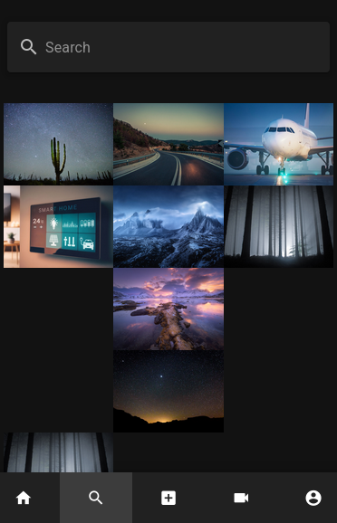
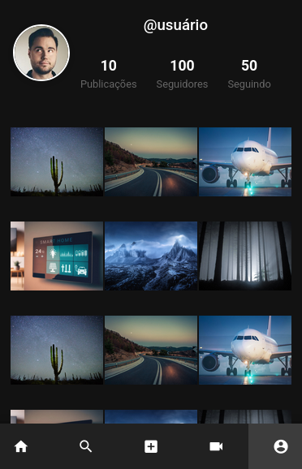

# New Instagram Clone

This project is a **front-end training application** built using **Vue 3** and **Vuetify 3**. It offers a modern UI development experience with optimized tooling and features. Additionally, it integrates **Ionic Capacitor** for seamless cross-platform development.

## 📸 Screenshots

Take a look at the app in action:





## 💡 Key Features

- **Vue 3 & Vuetify 3**: Create reactive and visually appealing user interfaces.
- **State Management**: Modular and efficient state handling with Pinia.
- **Routing**: Smooth single-page application navigation using Vue Router.
- **Tooling**: Accelerate development with Vite and automated component imports.
- **Cross-Platform Development**: Build apps for multiple platforms using Ionic Capacitor.

## 💿 Installation

Install the required dependencies with your preferred package manager:

```bash
yarn install
# or
npm install
# or
pnpm install
# or
bun install
```

## 🚀 Usage

### Development Server

Start the development server to preview your app:

```bash
yarn dev
```

Visit [http://localhost:3000](http://localhost:3000) to access the app.

### Production Build

Generate a production-ready build:

```bash
yarn build
```

## 📑 License

This project is licensed under the [MIT License](http://opensource.org/licenses/MIT).

Copyright (c) 2016-present Vuetify, LLC
